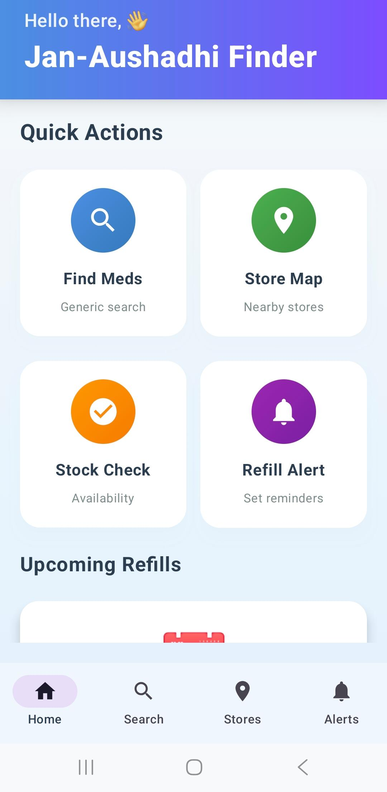
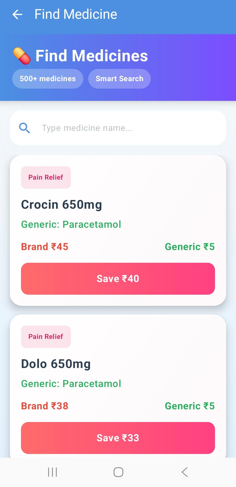
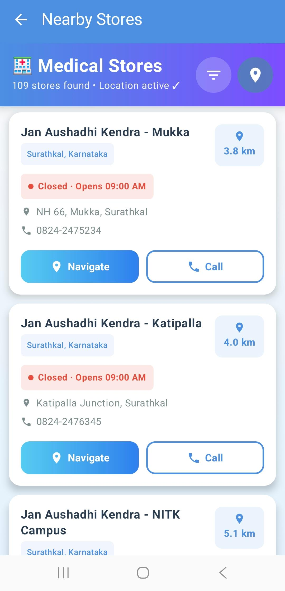

# 🏥 Jan-Aushadhi Finder
### Android App Development using GenAI — (Healthcare)
#### MindMatrix VTU Internship Program 2026

---

## 📱 About the App

**Jan-Aushadhi Finder** is an Android application that helps citizens locate the nearest **Jan Aushadhi stores** and find affordable generic alternatives to expensive branded medicines.

Generic medicines at Jan-Aushadhi stores are **50–90% cheaper** than branded ones — but most people don't know where the stores are or what the generic name of their medicine is. This app solves both problems.

---

## ✨ Features

| Feature | Description |
|--------|-------------|
| 💊 **Medicine Search** | Search any branded medicine and instantly see its generic equivalent |
| 💰 **Price Comparison** | Visual comparison: Branded ₹100 vs Generic ₹20 — see your savings |
| 🗺️ **Store Locator** | Find 190+ Jan-Aushadhi Kendras across India with live GPS distance |
| 📦 **Stock Checker** | Check which stores have your specific medicine in stock |
| 🔔 **Refill Reminders** | Set monthly alerts to never miss your medicine refill |
| 🤖 **Gemini AI Search** | Fuzzy search powered by Google Gemini — works even with typos |

---

## 📱 App Screenshots

| Home Screen | Medicine Search | Nearby Stores |
|-------------|----------------|----------------|
|  |  |  |

| Store Filter | Refill Reminders |
|--------------|------------------|
|  |  |

---

## 🛠️ Tech Stack

- **Language:** Kotlin
- **UI:** Jetpack Compose + Material 3
- **AI:** Google Gemini API (fuzzy medicine search)
- **Location:** Google Play Services — FusedLocationProviderClient
- **Navigation:** Jetpack Navigation Compose
- **Architecture:** Repository Pattern + StateFlow
- **Maps:** Google Maps Intent API
- **Min SDK:** Android 7.0 (API 24)

---

## 🗂️ Project Structure

```text
com.healthcare.janaushadhi/
├── data/
│   ├── models/
│   │   ├── Medicine.kt            # Medicine data model
│   │   ├── Store.kt               # Store information model
│   │   └── Reminder.kt            # Reminder data model
│   │
│   ├── repository/
│   │   ├── StoreRepository.kt     # Store and stock management
│   │   ├── ReminderRepository.kt  # Reminder handling logic
│   │   └── SampleData.kt          # Medicine dataset
│
├── ui/
│   ├── home/
│   │   └── HomeScreen.kt
│   ├── search/
│   │   └── SearchScreen.kt
│   ├── maps/
│   │   └── StoresScreen.kt
│   ├── stock/
│   │   └── StockCheckerScreen.kt
│   ├── reminders/
│   │   └── RemindersScreen.kt
│   └── theme/
│       ├── Color.kt
│       ├── Theme.kt
│       └── Type.kt
│
├── utils/
│   └── FuzzySearch.kt             # Advanced medicine search utility
│
└── MainActivity.kt                # Main entry point of the application
```

---

## 🚀 Getting Started

### Prerequisites

- Android Studio Hedgehog or later
- JDK 17
- Android device or emulator (API 24+)
- Google Gemini API key from aistudio.google.com

### Setup

1. **Clone the repository**

```bash
git clone https://github.com/YourUsername/JanAushadhiFinder.git
cd JanAushadhiFinder
```

2. **Open in Android Studio**

```text
File → Open → Select the project folder
```

3. **Add your Gemini API key**

In your `local.properties` file:

```properties
GEMINI_API_KEY=your_api_key_here
```

Or add it directly in your code where the Gemini client is initialized.

4. **Build and Run**

```text
Click ▶ Run in Android Studio
```

---

## 📊 Data Coverage

- **500+ medicines** across 15+ therapeutic categories
- **190+ Jan-Aushadhi Kendra stores** across India
- **40+ cities** including Mangalore, Bangalore, Mumbai, Chennai, Hyderabad, Delhi, Kolkata, Pune, Kochi, Jaipur, and more

---

## 🔑 Key Permissions

```xml
<uses-permission android:name="android.permission.ACCESS_FINE_LOCATION" />
<uses-permission android:name="android.permission.ACCESS_COARSE_LOCATION" />
<uses-permission android:name="android.permission.INTERNET" />
```

---

## 🧠 How Gemini AI Works

When you search a medicine name, two layers run:

1. **Local Fuzzy Search** — instant results from the 500+ medicine database
2. **Gemini AI** — handles severe typos, regional names, and unknown brands

### Example

```text
User types:  "paracetmol"

App finds:   Paracetamol → Generic of Crocin/Dolo
             Branded: ₹30  |  Generic: ₹8  |  Save: ₹22
```

---

## 📍 Store Locator Features

- ✅ Shows all stores even without location permission
- ✅ Tap 📍 to enable GPS — distances update in real time
- ✅ Filter by distance: 10 KM / 20 KM / 50 KM (needs GPS)
- ✅ Filter by any city in India (searchable)
- ✅ Filter by Open Now / Closed
- ✅ Navigate to store via Google Maps
- ✅ Call store directly from the app

---

## 💡 Impact

| Goal | Impact |
|------|--------|
| 💰 Affordable Healthcare | Save up to 90% on medicine costs |
| 📚 Health Literacy | Generic ≠ Low Quality — same composition, same efficacy |
| 🌍 Universal Access | Reaches tier-2 and tier-3 cities |
| 📱 Digital Health | Brings Jan Aushadhi scheme to smartphone users |

---

## 🔮 Future Enhancements

- [ ] Firebase backend for live updates
- [ ] Prescription scanner using Gemini Vision
- [ ] Push notifications for refill reminders
- [ ] Multilingual support (Kannada, Hindi, Tamil)
- [ ] In-app Google Maps fragment
- [ ] Barcode scanner for medicine identification

---
